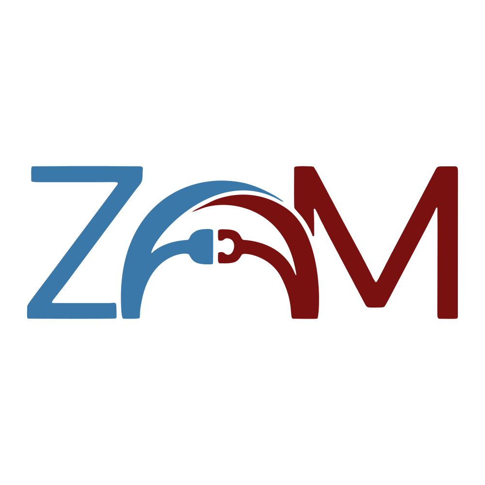

[](https://github.com/harm-nullix/zod-mongoose/actions/workflows/release.yml)
[](https://www.npmjs.com/package/@nullix/zod-mongoose)
[](https://github.com/harm-nullix/zod-mongoose/blob/main/packages/core/LICENSE.md)


# @nullix/zod-mongoose

A library which allows to author [mongoose](https://github.com/Automattic/mongoose) ("a MongoDB object modeling tool") schemas using [zod](https://github.com/colinhacks/zod) ("a TypeScript-first schema declaration and validation library").

## Purpose

Declaring mongoose schemas in TypeScript environment has always been tricky in terms of getting the most out of type safety:
* You either have to first declare an interface representing a document in MongoDB and then create a schema corresponding to that interface (you get no type safety at all - even the offical mongoose documentation says that "you as the developer are responsible for ensuring that your document interface lines up with your Mongoose schema")
* Or reverse things by using `mongoose.InferSchemaType<typeof schema>` which is far from ideal (impossible to narrow types, doesn't support TS enums, doesn't know about virtuals, has problems with fields named `type`, ...)
* Finally, you can use [typegoose](https://github.com/typegoose/typegoose) which is based on legacy decorators proposal and generally poorly infers types.

This library aims to solve many of the aforementioned problems utilizing `zod` as a schema authoring tool.

# Documentation
See the [full documentation](https://zodmongoose.com) for detailed usage examples and API reference.

### Automatic Validation & Transformation Mapping

`@nullix/zod-mongoose` automatically maps Zod's built-in validations and transformations to their corresponding Mongoose SchemaType options.

| Zod Check | Mongoose Option | Target Types |
| :--- | :--- | :--- |
| `.min(n)` | `minlength: n` | `z.string()` |
| `.max(n)` | `maxlength: n` | `z.string()` |
| `.length(n)` | `minlength: n`, `maxlength: n` | `z.string()` |
| `.regex(re)` | `match: re` | `z.string()` |
| `.trim()` | `trim: true` | `z.string()` |
| `.toLowerCase()` | `lowercase: true` | `z.string()` |
| `.toUpperCase()` | `uppercase: true` | `z.string()` |
| `.min(n)` / `.positive()` | `min: n` | `z.number()`, `z.date()` |
| `.max(n)` / `.negative()` | `max: n` | `z.number()`, `z.date()` |
| `.uuid()` | `type: Schema.Types.UUID` | `z.string()` |
| `.datetime()` | `type: Date` | `z.string()` |
| `.date()` | `type: Date` | `z.string()` |
| `.time()` | `type: String` | `z.string()` |

### Zod v4 & Mongoose 8 Support

This package is now optimized for **Zod v4** and **Mongoose 8**.

Key features:
- **Zod v4 registry**: Securely store Mongoose-specific metadata alongside Zod schemas using native Zod v4 registry.
- **Automatic Unwrapping**: Support for `.transform()`, `.pipe()`, `.preprocess()`, `.refine()`, `.optional()`, `.nullable()`, and `.brand()`.
- **Unions**: Primitive Zod unions (`string`, `number`, `boolean`, `date`, `bigint`) are mapped to Mongoose `Schema.Types.Union`. Object unions are automatically merged into a single schema object where all properties are optional, providing a flexible way to handle polymorphic data. Other complex unions fallback to `Mixed`.
- **Native BigInt**: Maps Zod `bigint` to native Mongoose `BigInt` (or `Number` as fallback). If you need Mongoose `Long` (64-bit integer), you can specify it via `withMongoose(z.bigint(), { type: 'Long' })`.
- **Specialized Types**: Direct support for `Buffer` and `ObjectId` via `zObjectId()` and `zBuffer()` helpers (or `z.instanceof()`).
- **Composite IDs**: Full support for object-based `_id` fields via `{ includeId: true }` metadata.
- **Isomorphic Support**: Use `setFrontendMode(true)` to allow schemas to be used in frontend environments where Mongoose is not available. Specialized types will automatically fall back to strings/Uint8Arrays while preserving Mongoose metadata for the backend.
- **Frontend Safe**: The package treats `mongoose` as an optional peer dependency. Core Zod schema definition and metadata helpers (`withMongoose`, `zObjectId`, etc.) are safe to use in the browser without installing `mongoose`.
- **Nuxt 4 Ready**: Fully compatible with Nuxt 4 and Nitro, supporting best practices like `readValidatedBody` with Zod schemas.
- **Hookable**: Extensible conversion process using `unjs/hookable`. Developers can hook into 15+ points (e.g., `schema:object:before`, `schema:union:before`).
- **Populated Helper**: `PopulatedSchema<T>` utility for perfect TypeScript inference of populated documents.

### Type Conversion Table

The following table shows how Zod types are mapped to Mongoose types by default.

| Zod Type | Mongoose Type | Notes |
| :--- | :--- | :--- |
| `z.string()` | `String` | Required by default unless `.optional()` is used. |
| `z.string().uuid()` | `mongoose.Schema.Types.UUID` | Maps to Mongoose's native UUID type. |
| `z.string().datetime()` | `Date` | Maps to Mongoose `Date` for automatic parsing and indexing. |
| `z.string().date()` | `Date` | Maps to Mongoose `Date`. |
| `z.number()` | `Number` | |
| `z.boolean()` | `Boolean` | |
| `z.date()` | `Date` | |
| `z.bigint()` | `BigInt` | Fallback to `Number` if `BigInt` is not supported. Use `withMongoose` with `type: 'Long'` for 64-bit integers. |
| `z.enum()` | `String` | Includes Mongoose `enum` validation. |
| `z.nativeEnum()` | `String` | Includes Mongoose `enum` validation. |
| `z.string().trim()` | `String` | Automatically sets `trim: true`. |
| `z.string().toLowerCase()` | `String` | Automatically sets `lowercase: true`. |
| `z.string().min(5)` | `String` | Automatically sets `minlength: 5`. |
| `z.array()` | `[]` | Mapped to a Mongoose array of the inner type. |
| `z.set()` | `[]` | Mapped to a Mongoose array of the value type. |
| `z.tuple()` | `[]` | Mapped to a Mongoose array of the first item's type. |
| `z.record()` | `Map` | Mapped to a Mongoose `Map` with `of` type. |
| `z.map()` | `Map` | Mapped to a Mongoose `Map` with `of` type. |
| `z.object()` | `Nested Object` | Mapped to a nested Mongoose schema or subdocument. |
| `z.intersection()` | `Nested Object` | Merges the definitions of both branches into a single object. |
| `z.union()` | `Schema.Types.Union` (primitives) or `Nested Object` (objects) | Mapped to `Union` for primitives, merged into an object for `z.object()` unions. Others fallback to `Mixed`. |
| `z.xor()` | `mongoose.Schema.Types.Mixed` | Non-inclusive union. Maps to `Mixed` with a custom Zod-based validator to enforce mutual exclusivity. |
| `z.discriminatedUnion()` | `Mongoose Discriminator` | Maps to native Mongoose discriminators. Common fields are automatically moved to the base schema. |
| `zObjectId()` | `mongoose.Schema.Types.ObjectId` | Specialized helper for ObjectIds. By default, it is omitted from the generated Mongoose schema to let Mongoose handle its auto-generation. |
| `zBuffer()` | `mongoose.Schema.Types.Buffer` | Specialized helper for Buffers. |
| `zPopulated()` | `mongoose.Schema.Types.ObjectId` | Helper for fields that can be either an `ObjectId` or a populated object. |
| `z.instanceof(Buffer)` | `mongoose.Schema.Types.Buffer` | |
| `z.instanceof(ObjectId)` | `mongoose.Schema.Types.ObjectId` | |
| `z.literal()` | `String` / `Number` / `Boolean` | Mapped to the literal's type with a Mongoose `enum` constraint. |
| `z.any()` / `z.unknown()` | `mongoose.Schema.Types.Mixed` | Fallback for unhandled types. |

### Unhandled and Unsupported Zod Types

The following Zod types are currently not explicitly handled or are unsupported by nature and will fall back to `Mongoose.Schema.Types.Mixed` unless a custom type is provided via `withMongoose`.

| Zod Type | Current Status | Recommended Alternative |
| :--- | :--- | :--- |
| `z.readonly()` | `Base Type` | Automatically unwrapped, applies `readOnly: true` metadata. |
| `z.promise()` | Unsupported | Not applicable for database schemas |
| `z.function()` | Unsupported | Not applicable for database schemas |
| `z.void()` / `z.never()` | Unsupported | |

> **Note:** Types like `z.branded()`, `z.readonly()`, `z.pipeline()`, `z.preprocess()`, and `z.transform()` are automatically unwrapped to their underlying base type during conversion.

## Installation

Install the package:

```shell
pnpm add @nullix/zod-mongoose
```

### Peer Dependencies

This package requires `zod` (^4.x). Note that `zod` imports should be from `zod/v4` to ensure compatibility.

`mongoose` (^8.x) is an **optional peer dependency**. It is only required on the **backend** when calling `toMongooseSchema()`. You do **not** need to install `mongoose` on the frontend.

## Usage

### Basic Conversion

```typescript
import { z } from 'zod/v4';
import { toMongooseSchema } from '@nullix/zod-mongoose';

const zodSchema = z.object({
  username: z.string().min(3),
  email: z.email(),
  age: z.number().optional(),
});

// Basic conversion
const mongooseSchema = toMongooseSchema(zodSchema);
```

### Plugins

You can pass Mongoose plugins directly to `toMongooseSchema`. This is the recommended way to extend your schemas with third-party or custom plugins.

```typescript
import { z } from 'zod/v4';
import { toMongooseSchema } from '@nullix/zod-mongoose';
import mongooseLeanVirtuals from 'mongoose-lean-virtuals';

const zodSchema = z.object({
  title: z.string(),
});

// Apply plugins during conversion
const mongooseSchema = toMongooseSchema(zodSchema, {
  plugins: [mongooseLeanVirtuals]
});

// The resulting schema now has the plugin applied
const Post = mongoose.model('Post', mongooseSchema);
const doc = await Post.findOne().lean({ virtuals: true });
```

### Hook: `schema:created`

For more advanced extensions, use the `schema:created` hook to modify the `mongoose.Schema` instance immediately after it is created.

```typescript
import { hooks } from '@nullix/zod-mongoose';

hooks.hook('schema:created', ({ schema, zodSchema }) => {
  // Add a virtual field to all schemas that have a 'title'
  if ('title' in zodSchema.shape) {
    schema.virtual('slug').get(function() {
      return this.title.toLowerCase().replace(/ /g, '-');
    });
  }
});
```

### Adding Mongoose Metadata

Use `withMongoose` to add Mongoose-specific field options like `unique`, `index`, or `required`.

```typescript
import { z } from 'zod/v4';
import { toMongooseSchema, withMongoose } from '@nullix/zod-mongoose';

const zodSchema = z.object({
  username: withMongoose(z.string(), { 
    unique: true, 
    index: true,
    lowercase: true 
  }),
  // Default values set with zod's .default() are respected
  roles: z.array(z.string()).default(['user']),
});

const mongooseSchema = toMongooseSchema(zodSchema);
```

### Timestamps

The `genTimestampsSchema` helper simplifies creating Mongoose-compatible Zod schemas with timestamp support.

```typescript
import { z } from 'zod/v4';
import { toMongooseSchema, genTimestampsSchema, withMongoose } from '@nullix/zod-mongoose';

const userSchema = withMongoose(
  z.object({
    name: z.string(),
    ...genTimestampsSchema(),
  }),
  { timestamps: true }
);

const mongooseSchema = toMongooseSchema(userSchema);
// Mongoose schema will have { timestamps: true } automatically.
```

### Discriminators

#### 1. Native Mongoose Discriminators (Recommended)

When using `z.discriminatedUnion()`, the library automatically maps it to native Mongoose discriminators. This provides the most robust way to handle polymorphic data in Mongoose, including proper indexing and query support.

Common fields (fields present in all union branches) are automatically extracted and moved to the base schema.

```typescript
import { z } from 'zod/v4';
import { toMongooseSchema } from '@nullix/zod-mongoose';

const ActivityZodSchema = z.discriminatedUnion('type', [
  z.object({
    type: z.literal('login'),
    timestamp: z.date(),
    ip: z.string()
  }),
  z.object({
    type: z.literal('post_create'),
    timestamp: z.date(),
    postId: zObjectId()
  }),
]);

const ActivitySchema = toMongooseSchema(ActivityZodSchema);
// Mongoose will create a base schema with 'timestamp' field
// and two discriminators ('login', 'post_create') for the other fields.

const ActivityModel = mongoose.model('Activity', ActivitySchema);
```

#### 2. Manual Discriminators

If you prefer to define discriminators manually on a base model, you can define the `discriminatorKey` in the base schema's metadata.

```typescript
import { z } from 'zod/v4';
import { toMongooseSchema, withMongoose } from '@nullix/zod-mongoose';

const baseSchema = withMongoose(
  z.object({
    name: z.string(),
    // Include the discriminator key in the Zod schema for type-safe access
    type: z.string().optional(),
  }),
  { discriminatorKey: 'type' }
);

const BaseModel = mongoose.model('Base', toMongooseSchema(baseSchema));

const carSchema = z.object({
  licensePlate: z.string(),
});

const CarModel = BaseModel.discriminator('Car', toMongooseSchema(carSchema));
```

### Non-Inclusive Unions (XOR)

Use `z.xor()` for unions where exactly one option must match. This is mapped to `Schema.Types.Mixed` with a custom Zod validator that enforces mutual exclusivity at the database level.

```typescript
const paymentSchema = z.xor([
  z.object({ type: z.literal('card'), cardNumber: z.string() }),
  z.object({ type: z.literal('bank'), accountNumber: z.string() }),
]);

const mongooseSchema = toMongooseSchema(z.object({ payment: paymentSchema }));
```

### ObjectIds and `_id` Handling

By default, `zObjectId()` creates a required Zod field (unless `.optional()` is used) but **omits** the field from the generated Mongoose schema. This allows Mongoose to manage the automatic generation and internal lifecycle of the `_id` field without conflicts.

#### 1. Standard Usage (Recommended)
For full document schemas, include the `_id` field using `zObjectId()`.

```typescript
const UserZodSchema = z.object({
  _id: zObjectId(), // Required for Zod validation, omitted from Mongoose schema
  name: z.string(),
});
```

#### 2. Input/Create Schemas
When validating data for new records (e.g., in a `POST` request), you should use an **Input Schema** that omits the `_id` field. This ensures that the client cannot provide an ID that Mongoose should be generating.

```typescript
const UserInputSchema = UserZodSchema.omit({ _id: true });
// Now UserInputSchema.parse({}) will succeed without an _id.
```

#### 3. Explicitly Defining `_id` in Mongoose
If you need to explicitly define the `_id` field in the Mongoose schema (e.g., to add an index, a custom getter, or to disable auto-generation), use the `includeId: true` flag.

```typescript
const CustomIdSchema = z.object({
  _id: zObjectId({ includeId: true, index: true }),
});
```

#### 4. Composite IDs
Mongoose supports composite IDs (using an object as the `_id`). You can define this in Zod by using an object for the `_id` field and setting `includeId: true` in the metadata of the `_id` field (or the parent object).

```typescript
const CompositeIdSchema = z.object({
  pk: z.string(),
  sk: z.string(),
});

const UserSchema = z.object({
  _id: withMongoose(CompositeIdSchema, { includeId: true }),
  name: z.string(),
});

const mongooseSchema = toMongooseSchema(UserSchema);
// Resulting Mongoose schema will have _id: { pk: String, sk: String }
```

### Buffers and ObjectIds

For specialized Mongoose types, use the provided `zObjectId()` and `zBuffer()` helpers. They also accept optional metadata.

```typescript
import { z } from 'zod/v4';
import { toMongooseSchema, zObjectId, zBuffer } from '@nullix/zod-mongoose';

const schema = z.object({
  avatar: zBuffer({ required: true }),
  ownerId: zObjectId({ index: true }),
  // Arrays are also supported
  tags: z.array(zObjectId()),
});

const mongooseSchema = toMongooseSchema(schema);
```

You can also use `z.instanceof(Buffer)` or `z.instanceof(mongoose.Types.ObjectId)` directly, which will be correctly inferred.

## API Reference

### `toMongooseSchema(zodSchema, options?)`
Converts a Zod schema to a Mongoose schema instance (`new mongoose.Schema(...)`).
- `zodSchema`: A Zod object or any Zod type.
- `options`: Optional Mongoose `SchemaOptions`.

### `extractMongooseDef(zodSchema)`
Converts a Zod schema to a Mongoose schema definition object (the POJO used as the first argument to `new mongoose.Schema(...)`). This is useful if you want to manually create the Mongoose schema or combine it with other definitions.
- `zodSchema`: A Zod object or any Zod type.

### `withMongoose(zodSchema, metadata)`
Attaches Mongoose-specific metadata to any Zod schema.
- `metadata`: A `MongooseMeta` object.

`MongooseMeta` extends Mongoose's `SchemaTypeOptions<any>` and `SchemaOptions`, allowing you to specify both field-level options (like `index`, `unique`, `lowercase`) and top-level schema options (like `collection`, `versionKey`, `strict`, `_id`, `id`) via the top-level Zod object.

```typescript
// Disable _id and id at the schema level
const LogSchema = withMongoose(
  z.object({ message: z.string() }),
  { _id: false, id: false }
);
```

### `PopulatedSchema<T, K>`
TypeScript utility type to extract the populated object type from a `zPopulated` union within a larger type. This is useful for typing Mongoose results after calling `.populate()`.

- `T`: The Zod-inferred type (e.g., `z.infer<typeof PostSchema>`).
- `K`: The key(s) to populate (optional). If omitted, it will try to populate all `zPopulated` fields in the object.

```typescript
import { PopulatedSchema } from '@nullix/zod-mongoose';

// Populate only the 'author' field
type PostWithAuthor = PopulatedSchema<z.infer<typeof PostSchema>, 'author'>;

// Populate all possible fields
type FullPost = PopulatedSchema<z.infer<typeof PostSchema>>;
```

### `zObjectId(options?)`
Helper to create a Zod schema representing a Mongoose `ObjectId`.
- `options`: Optional `MongooseMeta` for this field.

### `zPopulated(ref, schema, options?)`
Helper for fields that can be either an `ObjectId` (unpopulated) or a populated object.
- `ref`: The name of the Mongoose model being referenced.
- `schema`: The Zod schema representing the populated object.
- `options`: Optional `MongooseMeta` for this field.

```typescript
const UserSchema = z.object({ name: z.string() });
const PostSchema = z.object({
  author: zPopulated('User', UserSchema),
});
```

### `zBuffer(options?)`
Helper to create a Zod schema representing a Mongoose `Buffer`.
- `options`: Optional `MongooseMeta` for this field.

### `setFrontendMode(enabled)`
Enable or disable frontend mode.
- `enabled`: `boolean`.
- In frontend mode, `zObjectId` falls back to a regex-validated string, and `zBuffer` falls back to `Uint8Array`.
- This allows schemas to be shared between frontend and backend without requiring Mongoose on the client.

### `genTimestampsSchema(createdAtField?, updatedAtField?)`
Returns a plain object (Zod shape) with timestamp fields. This allows for easy spreading into `z.object()`.
- Default fields are `createdAt` and `updatedAt`.
- Pass `null` to disable a specific field.

```typescript
const schema = z.object({
  ...genTimestampsSchema(),
  name: z.string(),
});
```

---

## Hooks

`@nullix/zod-mongoose` uses `unjs/hookable` to provide an extensible conversion process. Developers can register hooks to modify the Mongoose definition at any point of the conversion.

### Registering Hooks

```typescript
import { hooks } from '@nullix/zod-mongoose';

// Modify every string field to be uppercase
hooks.hook('converter:node', (context) => {
  if (context.type === 'string') {
    context.mongooseProp.uppercase = true;
  }
});

// Add a custom property after any validation mapping
hooks.hook('validation:mappers', (context) => {
  context.mongooseProp.customField = 'my-value';
});
```

### Available Hooks

The following hook points are available:

- `converter:before`: Called before starting the conversion.
- `converter:start`: Called at the start of each `extractMongooseDef` call (recursive).
- `converter:unwrapped`: Called after unwrapping a Zod schema and extracting metadata.
- `converter:node`: Called for each Zod type node being processed.
- `converter:after`: Called after a node's conversion is complete.
- `schema:object:before`: Called before processing a `z.object()`.
- `schema:object:field`: Called for each field in a `z.object()`.
- `schema:object:after`: Called after processing a `z.object()`.
- `schema:array:before`: Called before processing a `z.array()`, `z.set()`, or `z.tuple()`.
- `schema:array:after`: Called after processing an array-like type.
- `schema:record:before`: Called before processing a `z.record()` or `z.map()`.
- `schema:record:after`: Called after processing a record/map type.
- `schema:union:before`: Called before processing a `z.union()` or `z.discriminatedUnion()`. Provides a `ctx` object with `isSimpleUnion` which can be modified to force the use of `Schema.Types.Union`.
- `schema:union:after`: Called after processing a union.
- `registry:get:before`: Called before retrieving metadata from the registry.
- `registry:get`: Called when retrieving metadata from the registry.
- `registry:add`: Called before adding metadata to the registry.
- `registry:added`: Called after adding metadata to the registry.
- `validation:mappers`: Called after mapping Zod validations to Mongoose options.
- `schema:created`: Called after a `mongoose.Schema` instance is created (for `toMongooseSchema`).

---

## Deprecated

The following features from older versions of `mongoose-zod` (Mongoose 7 / Zod 3) are no longer supported or have changed:

- **`mongooseZodCustomType()`**: This was previously used to directly define a Mongoose type on a Zod schema. In the new version, use `withMongoose(z.any(), { type: mongoose.Schema.Types.YourType })` or specialized helpers like `zObjectId()` and `zBuffer()`.
- **`toZodMongooseSchema()`**: Previously, this returned a `ZodMongoose` wrapper used to generate the Mongoose schema. This function has been replaced by `toMongooseSchema()` which returns a full `mongoose.Schema` instance, or `extractMongooseDef()` which returns the raw Mongoose schema definition (POJO).
- **`toMongooseSchema()`**: In the old version, this was a method on the `ZodMongoose` instance. Now it's a standalone function that accepts a Zod schema and returns a `mongoose.Schema` object.
- **`ZodMongoose` class**: Replaced by standard Zod types with registry-stored metadata.
- **`setup({ z })`**: No longer required. The library uses the `zod/v4` registry directly and does not modify the Zod prototype.
- **`.mongoose()`, `.mongooseTypeOptions()`, `.mongooseSchemaOptions()`**: These prototype extensions are deprecated. Use `withMongoose()` instead.
- **Automatic Plugin Loading**: Optional peer dependencies like `mongoose-lean-*` are no longer automatically attached. Plugins should be applied to the Mongoose schema manually.